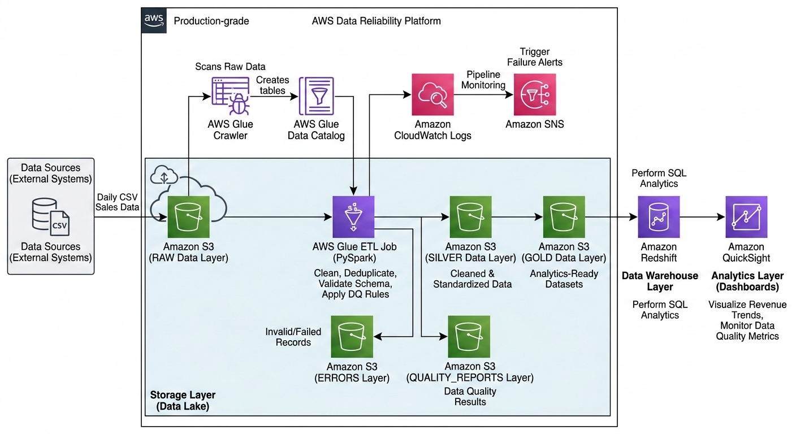

# Production-Grade AWS Data Reliability Platform

Status: 🚧 Building a production-grade AWS data pipeline with monitoring, data quality checks, and failure handling.

A real-world **data engineering project** that simulates how modern data teams build **reliable, observable, and production-ready data pipelines on AWS**.

This system ingests messy CSV data from external systems, processes it through a **multi-layered data lake architecture**, performs **data quality checks**, monitors pipeline health, and delivers trusted analytics dashboards.

---

# Architecture Overview

The platform follows a **Bronze–Silver–Gold data lake architecture**:

- **Raw Layer (Bronze)** → Incoming unprocessed data  
- **Silver Layer** → Cleaned and standardized data  
- **Gold Layer** → Analytics-ready datasets  

Additional layers handle **errors and data quality reporting**.

---

# Tech Stack

| Layer | Technology |
|------|-------------|
| Data Storage | Amazon S3 |
| Metadata Catalog | AWS Glue Data Catalog |
| Data Discovery | AWS Glue Crawler |
| ETL Processing | AWS Glue (PySpark) |
| Monitoring | Amazon CloudWatch |
| Alerts | Amazon SNS |
| Data Warehouse | Amazon Redshift |
| Analytics | Amazon QuickSight |

---

# Data Pipeline Flow
External CSV Sources
↓
Amazon S3 (RAW Layer)
↓
AWS Glue Crawler
↓
Glue Data Catalog
↓
AWS Glue ETL Job (PySpark)
↓
Silver Layer (Clean Data)
↓
Gold Layer (Analytics Ready)
↓
Amazon Redshift
↓
Amazon QuickSight Dashboard

Monitoring Flow:
Glue Job → CloudWatch Logs → SNS Alerts

---

# Data Lake Structure
aws-data-reliability-platform/
│
├── raw/
│ └── source_sales/
│
├── silver/
│
├── gold/
│
├── errors/
│
└── quality_reports/

---

# Data Quality Framework

The pipeline performs automated validation checks to ensure **data reliability**.

| Check | Description |
|------|-------------|
| Null Check | Detect missing values |
| Duplicate Check | Remove duplicate transactions |
| Range Validation | Identify invalid revenue values |
| Schema Validation | Detect schema drift |
| Date Validation | Detect invalid or future dates |

Data quality results are stored in the **quality_reports layer**.

---

# Failure Handling

Invalid or corrupted records are automatically separated from valid datasets.

Examples of detected issues:

- Missing revenue values
- Duplicate transaction IDs
- Invalid date formats
- Negative revenue values
- Incorrect data types

Failed records are stored in:
S3/errors/

This ensures the pipeline **never silently corrupts analytics data**.

---

# Monitoring and Alerts

Pipeline health is monitored using:

- **Amazon CloudWatch Logs**
- **Amazon SNS Alerts**

Alerts trigger when:

- ETL jobs fail
- Data quality checks fail
- Unexpected schema changes occur

This enables **real-time observability of the data pipeline**.

---

# Analytics Dashboard

Final datasets are loaded into **Amazon Redshift** and visualized using **Amazon QuickSight dashboards**.

Example analytics include:

- Daily revenue trends
- Revenue by country
- Failed transaction rate
- Data quality score over time

---

# Example Data Issues Simulated

To replicate real production scenarios, the dataset intentionally includes:

- Duplicate records
- Missing values
- Invalid date formats
- Schema drift
- Negative revenue values
- Incorrect data types

This helps simulate **real-world data engineering challenges**.

---

# Future Improvements

Planned enhancements include:

- CI/CD pipeline using GitHub Actions
- Infrastructure provisioning with Terraform
- Automated pipeline reruns
- Data lineage tracking
- Data freshness SLA monitoring

---

# Skills Demonstrated

This project demonstrates practical skills in:

- Data lake architecture
- ETL pipeline design
- Data quality engineering
- Cloud data platforms
- Pipeline monitoring
- Data observability
- Data warehouse integration

---

# Project Status

🚧 In Progress

This project is being developed step-by-step to simulate **real production data engineering systems** used in modern cloud environments.
