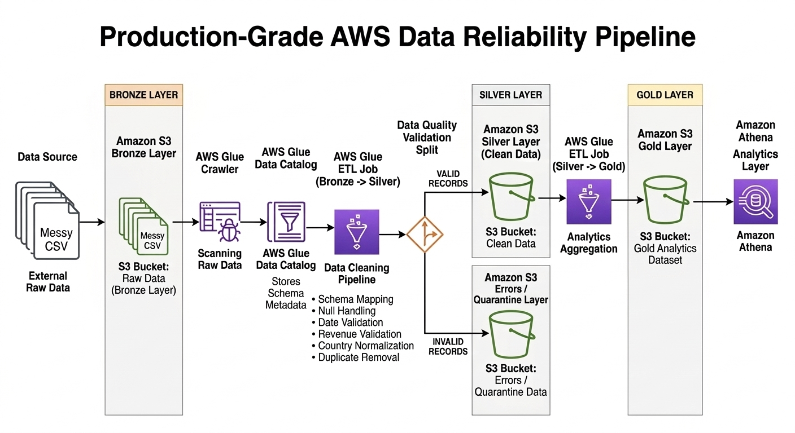
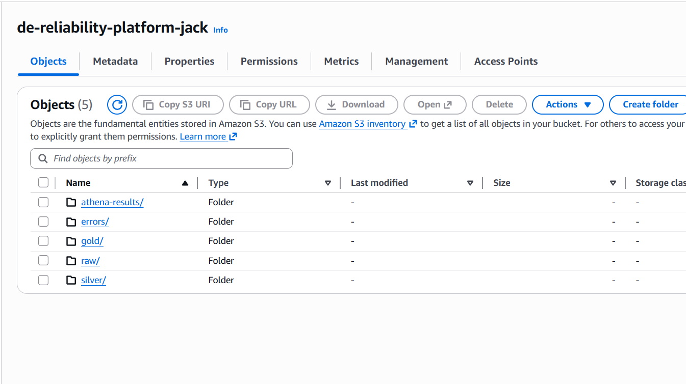
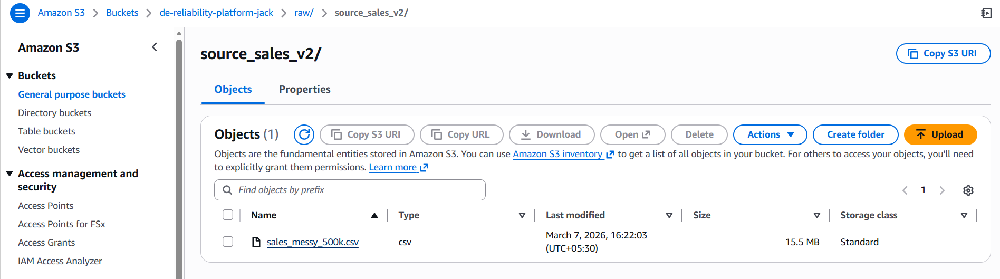
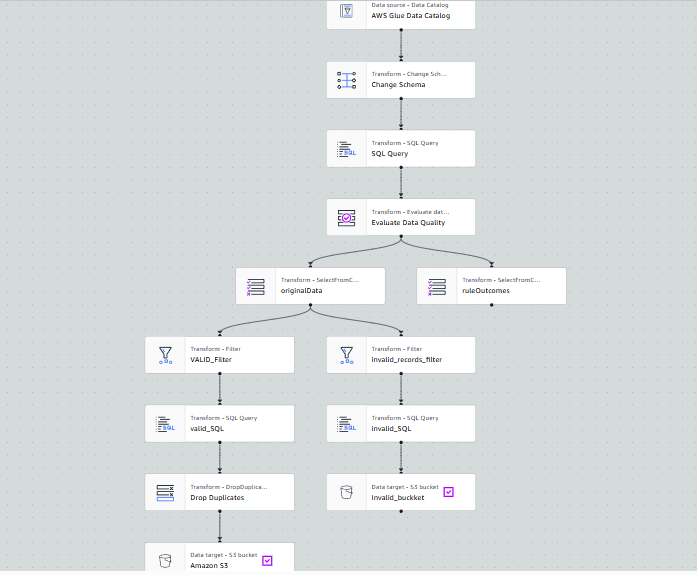
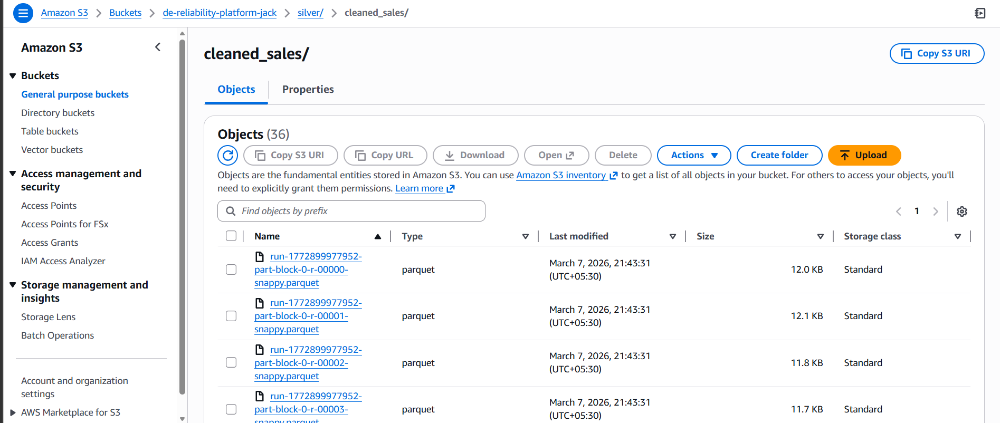
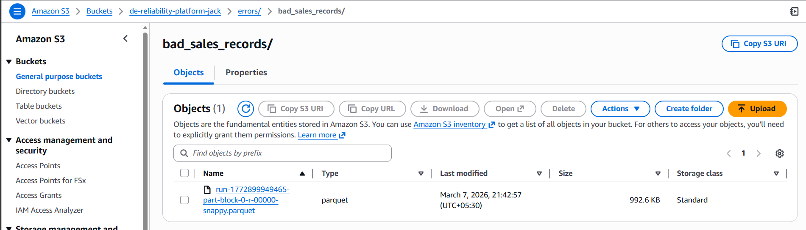
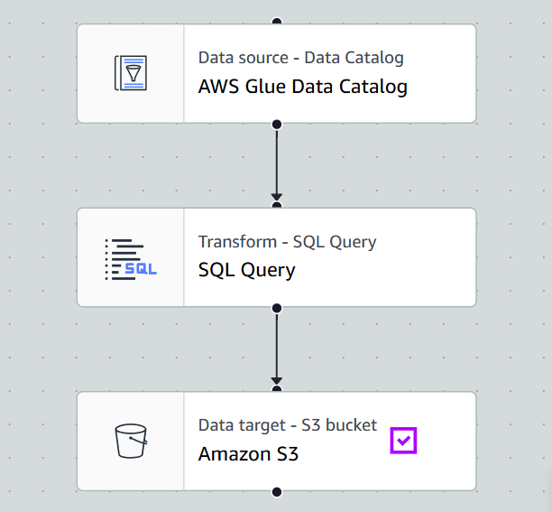
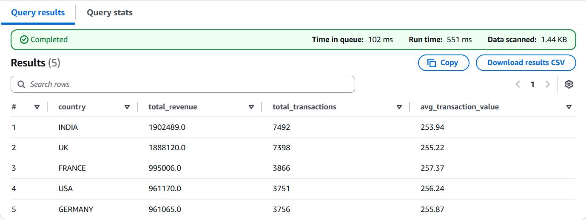

# Production-Grade AWS Data Reliability Pipeline

## Project Overview

This project demonstrates how modern data teams build **reliable, production-ready data pipelines on AWS** using a **Bronze → Silver → Gold data lake architecture**.

The system ingests messy CSV data, validates and cleans the data using serverless ETL pipelines, quarantines invalid records, and produces trusted analytics datasets for SQL analysis.

The project simulates a **real-world data engineering workflow** where raw data from external systems must be transformed into reliable analytics datasets.

---

# Architecture



---

# Architecture Flow

```
Messy CSV Data
      ↓
Amazon S3 Bronze Layer (Raw Data)
      ↓
AWS Glue Crawler
      ↓
AWS Glue Data Catalog
      ↓
AWS Glue ETL Job (Bronze → Silver)
      ↓
Data Quality Validation
      ├── Valid Records → Amazon S3 Silver Layer
      └── Invalid Records → Amazon S3 Errors / Quarantine Layer
                                ↓
                        AWS Glue ETL Job (Silver → Gold)
                                ↓
                           Amazon S3 Gold Layer
                                ↓
                         Amazon Athena Analytics
```

---

# Technologies Used

* Amazon S3 — Data Lake Storage
* AWS Glue — Serverless ETL Pipelines
* AWS Glue Data Catalog — Metadata Management
* Amazon Athena — Serverless SQL Analytics
* Apache Spark — Data Transformations

---

# Data Lake Layers

## Bronze Layer (Raw Data)

The Bronze layer stores raw incoming data exactly as received from external systems.

Example path:

```
s3://de-reliability-platform-jack/raw/source_sales_v2/
```

Characteristics:

• Raw CSV files
• No transformations
• Immutable storage

---

## Silver Layer (Clean Data)

The Bronze dataset is cleaned and validated using AWS Glue ETL jobs.

Data quality checks include:

* Schema validation
* Null handling
* Revenue validation
* Date standardization
* Country normalization
* Duplicate removal

Valid records are written to:

```
s3://de-reliability-platform-jack/silver/cleaned_sales/
```

Invalid records are moved to the quarantine layer:

```
s3://de-reliability-platform-jack/errors/bad_sales_records/
```

---

## Gold Layer (Analytics Dataset)

The Silver dataset is aggregated to produce analytics-ready datasets.

Example metrics generated:

* Total revenue by country
* Total transaction count
* Average transaction value

Stored in:

```
s3://de-reliability-platform-jack/gold/sales_summary/
```

---

# Example SQL Analytics (Athena)

Example query used to analyze the final dataset:

```sql
SELECT
    country,
    total_revenue,
    total_transactions,
    ROUND(avg_transaction_value,2) AS avg_transaction_value
FROM gold_sales_summary
ORDER BY total_revenue DESC;
```

Example output:

| Country | Total Revenue | Transactions | Avg Transaction |
| ------- | ------------- | ------------ | --------------- |
| INDIA   | 1,902,489     | 7,492        | 253.93          |
| UK      | 1,888,120     | 7,398        | 255.22          |
| FRANCE  | 995,006       | 3,866        | 257.37          |
| USA     | 961,170       | 3,751        | 256.24          |
| GERMANY | 961,065       | 3,756        | 255.87          |

---

# Pipeline Screenshots

## S3 Data Lake Structure



---

## Raw Data Ingestion



---

## Bronze → Silver ETL Pipeline



---

## Silver Layer Output



---

## Error Quarantine Layer



---

## Silver → Gold Aggregation



---

## Athena Query Results



---

# Repository Structure

```
aws-data-reliability-platform
│
├── architecture
│   └── architecture-diagram.png
│
├── datasets
│   └── sample_sales_data.csv
│
├── glue-jobs
│   └── bronze_to_silver.py
│
├── sql
│   └── athena_queries.sql
│
├── screenshots
│   ├── s3-data-lake-layers.png
│   ├── raw-data-ingestion.png
│   ├── glue-bronze-to-silver-etl.png
│   ├── silver-layer-output.png
│   ├── error-quarantine-layer.png
│   ├── silver-to-gold-etl.png
│   └── athena-query-results.png
│
└── README.md
```

---

# Future Improvements

Possible production improvements:

• Pipeline orchestration using AWS Step Functions
• Monitoring using CloudWatch and SNS
• Visualization dashboards using QuickSight
• Data partitioning for large-scale datasets
• Infrastructure deployment using Terraform

---

# Author

**Aravind**

Electronics & Telecommunication Engineering
Aspiring Data Engineer | Cloud Data Systems
